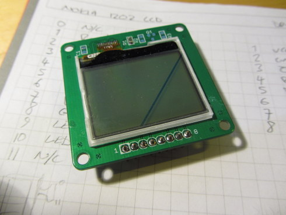

Nokia 1202 LCD breakout board
=============================

This is a simple Break-out board for the LCD found in Nokia 1202 phones.
The LCD is B/W 96x68px and driven by a 9bit SPI. 
The LCD terminates in a 12 pin 0.6mm pitch flex connector. 
It's tiny but still within the bounds of hand soldering.

The board is modelled on the Sparkfun 5110 breakout and shares 
the same pin-out in order to drop into an existing project.

